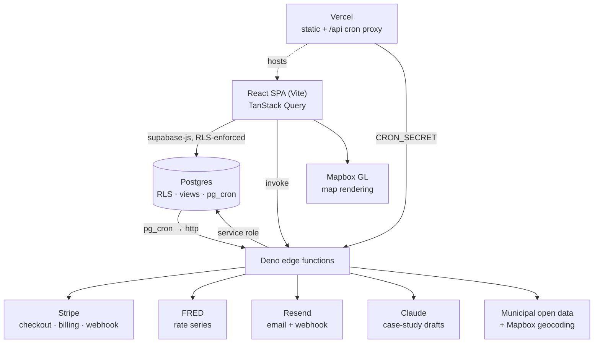

# TW Ventures

A real estate investment and development workspace: underwrite a deal, source
distressed leads, then run the project that follows — budgets, costs, draws,
milestones and investor capital — against the rate environment it was priced in.

## What it does

The app is organised as six modules behind one shell. Underwriting produces a
saved, comparable deal; the portfolio side tracks what happens after the deal
closes; the public side publishes finished work as case studies. Access is
role-aware throughout — an investor, a client and a project manager looking at
the same project see different numbers, enforced in Postgres rather than in the
UI.

- **Underwriting** — a full BRRRR model (buy, rehab, rent, refinance) and a
  traditional buy-and-hold rental analysis, both amortising real debt. Deals
  save with their inputs and results, and can be compared side by side on six
  metrics.
- **Amortisation** — per-year principal/interest/balance schedule for a loan,
  charted, with the interest share of each year's payment.
- **Deal sourcing** — leads from public municipal sources (code violations,
  tax-delinquent, pre-foreclosure, evictions, REO), scored 0–100 with the
  reasons shown, filterable by smart presets, plotted on a map, and tracked
  through a review state.
- **Project lifecycle** — projects carry an approved budget broken into line
  items, actual costs, draw requests with their own line items, and milestones
  with due dates. Budget variance and overdue-milestone counts roll up to a
  health signal per project.
- **Investor records** — investor entities, per-project commitments, and a
  transaction ledger. The portfolio read model exposes committed, contributed
  and distributed amounts, and hides them from project managers.
- **Project updates and documents** — published updates and audience-scoped
  files, so a client or investor sees a curated view rather than the whole
  project.
- **CRM** — contacts linked to projects, with follow-ups and activity history.
- **Public portfolio** — completed projects published as case studies with
  captioned photo galleries, geocoded to a map, each with its own SEO metadata.
  Draft copy can be generated from project facts via Claude.
- **Rates dashboard** — 15 FRED series: the Fed target range, effective fed
  funds and SOFR; the 3-month, 2-, 10- and 30-year Treasury points plus the
  10Y–2Y spread; 30- and 15-year mortgage rates, bank prime, credit card, auto
  and savings rates. Shown with each series' publication cadence and the next
  FOMC date.
- **Subscriptions** — Stripe Checkout and billing portal, with entitlements
  gating module access.
- **Notifications** — transactional email through Resend with an outbox,
  per-user preferences, unsubscribe handling, and web push.

Two things the app deliberately does *not* do. It does not connect bank
accounts — there is no Plaid integration, and the surfaces that once used one
were removed. And the rates dashboard does not forecast: implying where rates
are going needs Fed Funds futures, which FRED does not carry, so it reports
observed rates only.

## How the numbers work

The underwriting core is [`brrrrCalculations.ts`](src/components/app/real-estate/brrrrCalculations.ts).
It takes 20 inputs across the four BRRRR phases and returns 20 derived figures.
Debt is priced with a standard amortising payment — `P·r(1+r)^n / ((1+r)^n − 1)`
on a monthly rate, with the zero-rate case handled as straight-line, since
seller financing at 0% is a real input rather than an edge case.

**Buy.** Down payment is a percentage of purchase price. Acquisition cost is
price plus closing costs plus fees; the cash you actually put up is the down
payment plus those same costs, not the full price.

**Rehab.** The renovation budget is grossed up by a contingency percentage.
Holding cost is a monthly carry multiplied by the rehab duration. Adding these
to the initial cash gives **pre-stabilisation investment** — every dollar in
before the property produces income.

**Rent.** Gross rent is discounted by a vacancy rate to an effective rent.
Operating expenses (management, insurance, taxes, maintenance) are subtracted
to give **NOI**. Subtracting the purchase loan's amortised payment gives
pre-refinance cash flow, and annualising that over pre-stabilisation investment
gives pre-refinance ROI.

**Refinance.** The new loan is ARV × refinance LTV. Cash out is that loan less
the existing loan balance and refinance costs, floored at zero. The new
amortised payment at the new rate and term is subtracted from NOI to give
post-refinance cash flow, and ARV less the new loan is remaining equity.

Three results carry decisions worth stating plainly, because the obvious
implementation of each is wrong:

- **Post-refinance ROI when all capital is returned.** Total investment is
  pre-stabilisation investment less cash out, floored at zero. When the
  refinance returns every dollar invested, that denominator is zero and the
  return on remaining capital is unbounded. This is the BRRRR success
  condition, not an error, so the result is `±Infinity` by sign of cash flow —
  which sorts and compares correctly against finite deals — and renders as
  `∞`. Reporting `0` would rank the best available outcome as the worst.
- **Equity created** is ARV less *everything* spent to reach it: purchase
  price, closing costs, fees, the grossed-up rehab and the carry. Measuring it
  against purchase price alone would overstate it by the entire cost of the
  work.
- **Percentages guard their denominator**, returning 0 rather than `NaN` or
  `Infinity` when the base is empty.

Alongside those: **capital recycled** is cash out over pre-stabilisation
investment, and **rent-to-value** is annual rent over ARV.

Saved deals are versioned. `underwriting_versions` is an append-only ledger
keyed `(deal_id, version)` holding the inputs, results and assumptions of each
run, so a deal's history is auditable rather than overwritten.

**Lead scoring** ([`dealSourcingInsights.ts`](src/lib/dealSourcingInsights.ts))
is additive and transparent, clamped to 0–100: severity (25/12), a distressed
flag (20), lead type (15 for pre-foreclosure, tax-delinquent or REO; 8 for code
violations or evictions), a known property value (10), incident recency (10
under 30 days, 5 under 90), owner name (5), a source link (5), and multiple
distress signals (5). Missing data is penalised — no address −10, no city −5.
Scores band into High Priority (≥75), Promising (≥50), Needs Review (≥25) and
Low Signal, and every lead carries the list of reasons behind its score.

**Project health** is derived in SQL, not the client: a project is `at_risk`
when on hold or carrying overdue milestones, `attention` when past its target
completion date while still active, `needs_plan` when active with no milestones
at all, and `on_track` otherwise.

**Delivery-model comparison**
([`projectManagementSavings.ts`](src/lib/projectManagementSavings.ts)) holds the
base trade budget constant across both models so the only variable is the
oversight assumption, and clamps inputs to a sane range. It is explicitly
illustrative, not a quote.

## Tech stack

React 18 · TypeScript 5.5 · Vite 5 · Tailwind CSS 3 · shadcn/Radix primitives ·
TanStack Query 5 · React Router 7 · Recharts · Mapbox GL 3 ·
Supabase (Postgres, RLS, Auth, Storage, Deno edge functions) · Stripe ·
Resend · FRED · Vitest · Playwright · ESLint 9 · Capacitor (iOS/Android shell)

## Architecture

The browser talks to Postgres directly through the Supabase client, with row
level security as the authorisation boundary. Anything needing a secret — a
third-party key, a webhook signature, service-role access — runs in an edge
function instead.



Two details that matter in practice. The notification dispatcher is scheduled
by `pg_cron` inside the database rather than by the host, because Vercel's Hobby
tier allows only daily cron jobs — a 5-minute outbox drain had to move
server-side. And RLS policies wrap `auth.uid()` as `(select auth.uid())` so
Postgres evaluates it once per query instead of once per candidate row.

## Running locally

**Prerequisites** — Node 22+ (per `engines`) and npm. Optionally the
[Supabase CLI](https://supabase.com/docs/guides/local-development) and Docker if
you want a local database, and the Deno extension if you'll edit edge functions.

```bash
git clone https://github.com/Rjmoodie/twv.git
cd twv
npm ci
cp .env.example .env
```

Fill in `.env`. Every variable is documented in
[`.env.example`](.env.example), which lists only variables the code actually
reads.

**Required** — `VITE_SUPABASE_URL` and `VITE_SUPABASE_ANON_KEY`. These are
inlined at build time, so a production build aborts without them rather than
deploying a bundle that can never authenticate. For a CI smoke build with no
backend, set `ALLOW_MISSING_SUPABASE=1`.

**Optional** — `VITE_MAPBOX_TOKEN` (without it the sourcing and portfolio maps
don't render; everything else works) and `VITE_VAPID_PUBLIC_KEY` (web push).

**Server-side secrets** are never in `.env`. They belong to the edge functions
and are set with `supabase secrets set NAME=value` — `FRED_API_KEY` for the
rates panel, `STRIPE_SECRET_KEY` and `STRIPE_WEBHOOK_SECRET` for subscriptions,
`RESEND_API_KEY` for email, `ANTHROPIC_API_KEY` for case-study drafting.
Missing ones degrade the matching feature rather than breaking the app:
`fetch-rates` without a FRED key answers 200 with an empty set, and the panel
says so.

```bash
npm run dev          # http://localhost:8081
```

To run the backend locally:

```bash
supabase start                        # Postgres, Auth, Storage, edge runtime
supabase db reset                     # apply migrations in timestamp order
supabase functions serve fetch-rates  # a single function, with secrets from .env
```

Point `VITE_SUPABASE_URL` and `VITE_SUPABASE_ANON_KEY` at the local stack that
`supabase start` prints.

## Project structure

```
src/
  components/app/        Feature modules behind the shell
    real-estate/           BRRRR + rental calculators, deal sourcing, comparison
    portfolio/             Projects, budgets, draws, milestones, investor capital
    crm/                   Contacts, activities, follow-ups
    dashboard/             Rates snapshot
    account/               Profile, security, notification preferences
    layout/ navigation/    Shell, routing chrome, breadcrumbs
  components/ui/         Shared primitives (shadcn/Radix)
  pages/                 Routed pages, incl. public portfolio and intake forms
  lib/                   Pure logic: lead scoring, savings model, chart theme
  hooks/                 Cross-cutting React hooks
  services/              API clients, including the rates service
  config/                Module registry access rules and pricing tiers
  integrations/supabase/  Client and generated database types
supabase/
  migrations/            Ordered schema ledger, annotated in its own README
  functions/             Deno edge functions, one per responsibility
  tests/                 pgTAP suites for RLS and tenant isolation
api/                     Vercel serverless: sitemap, cron proxy
scripts/                 Type gate, bundle analysis, seeding, admin SQL
tests/                   Playwright end-to-end specs
docs/                    Architecture, deployment, security notes
```

## Scripts

| Script | What it does |
|---|---|
| `npm run dev` | Vite dev server on port 8081 |
| `npm run build` | Production build (fails without Supabase env) |
| `npm run preview` | Serve the built bundle |
| `npm run typecheck` | Type gate — fails on any error in the app project |
| `npm run lint` | ESLint across the repo |
| `npm run lint:fix` | ESLint with autofix |
| `npm test` | Vitest unit suite |
| `npm run test:watch` | Vitest in watch mode |
| `npm run test:coverage` | Unit suite with coverage |
| `npm run test:e2e` | Playwright end-to-end specs |
| `npm run build:analyze` | Bundle composition report |
| `npm run lighthouse` | Lighthouse CI run |
| `npm run security:audit` | `npm audit` on production dependencies |
| `npm run cap:ios` / `cap:android` | Build and open the native shell |

`typecheck` runs through [`scripts/typecheck-gate.mjs`](scripts/typecheck-gate.mjs)
rather than calling `tsc` directly: the root `tsconfig.json` sets `"files": []`
and only lists project references, which `tsc --noEmit` ignores without
`--build`, so the obvious command exits 0 no matter what is broken.

## Screenshots

<!-- Dashboard — rates snapshot and operational overview -->
<!--  -->

<!-- BRRRR calculator — inputs and derived results -->
<!--  -->

<!-- Deal sourcing — scored leads, filters, map -->
<!--  -->

<!-- Portfolio — project health, budgets, milestones -->
<!--  -->

<!-- Public case study — gallery and project map -->
<!--  -->

## Status

Active development; used for real property analysis and project tracking rather
than as a demo.

---

Roderick Moodie — [LinkedIn](https://www.linkedin.com/in/roderick-moodie)
